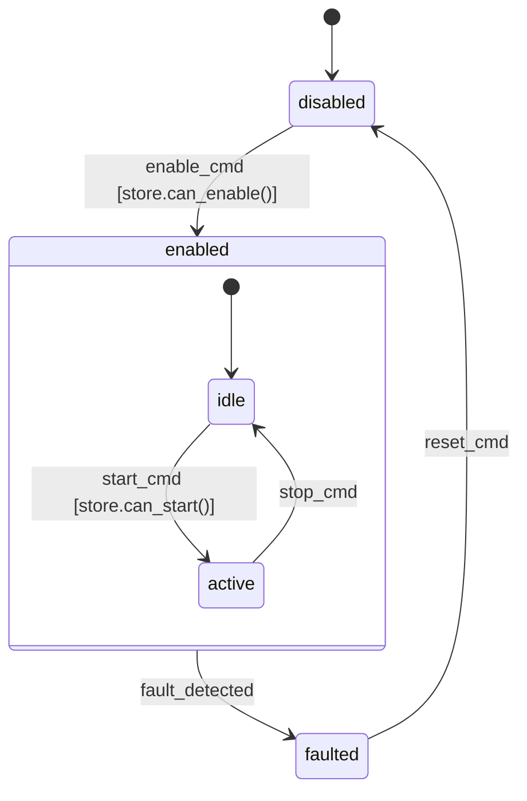

# msrs Services Development Guide

Use this skill whenever you are working on a Rust service that uses the **msrs** framework ([goromal/msrs](https://github.com/goromal/msrs)) — designing a new service from an FSM diagram, implementing it, reviewing code for compliance, or debugging behavior.

**Ground-truth note:** compiler-verified cu29/statig signatures live in the msrs repo at `docs/superpowers/notes/copper-statig-signatures.md`. That file is updated alongside the code and **wins over this skill on any conflict**. Consult it before fighting the compiler on trait shapes, payload bounds, or RON parsing.

---

## Framework Overview

**msrs** packages deterministic, FSM-driven microservices on top of [copper-rs](https://github.com/copper-project/copper-rs) (`cu29`, a data-oriented deterministic robotics runtime) and [statig](https://github.com/mdeloof/statig) (hierarchical state machines). Every service follows the same layering:

```
┌───────────────────────────────────────────────┐
│  Transport (own driver thread, RtConfig)      │  ← middleware I/O only (gRPC/zenoh/etc.)
├────────────────── channels ───────────────────┤
│  IngressTask → FsmTask → EgressTask           │  ← copper-rs DAG, deterministic, logged
│                  │                            │
│         statig FSM (handlers)                 │  ← dispatch + transitions
│                  │                            │
│         Store (pure business logic)           │  ← unit-testable in isolation
└───────────────────────────────────────────────┘
```

**The golden rule:** business logic lives exclusively in pure `Store` methods and statig state handlers, reachable through the copper-agnostic `FsmSpec::step` seam. Everything above that seam must be testable with `msrs_core::run_step` — no copper runtime, no threads, no I/O.

**The determinism rule:** the copper runtime records every task input/output to a unified log. A service is correctly factored **iff** re-running its FSM over the recorded inputs reproduces the recorded outputs bit-for-bit. This is enforced at bring-up (see the gate below), and it is why handlers must never read wall-clock time, environment, or randomness — time arrives only via `Trigger::Tick(nanos)` from the runtime clock.

---

## Design First: SPEC.md + Mermaid FSM Diagram

Every new service starts from a `SPEC.md` in the service repo, written (or approved) by the human **before implementation**. Agents implement *against the spec*, and reviewers diff the diagram against the statig machine mechanically.

### SPEC.md template

````markdown
# <service-name> — Service Spec

## Purpose
One paragraph: what the service does and why it exists.

## Messages
| Direction | Type (newtype) | Contents | Notes |
|-----------|----------------|----------|-------|
| Inbound   | `FooCmd`       | ...      | copper payloads must be newtypes (see Payload Rules) |
| Outbound  | `FooStatus`    | ...      | |

## Transport
Which middleware carries these messages (loopback / gRPC / zenoh / ...) and
any RtConfig requirements (scheduler policy, core pinning).

## State Machine


Cross-cutting modes (enable/disable, fault supersedence, e-stop) are Mermaid
composite states, which map 1:1 to statig superstates (see Hierarchical Modes).

## Store
Invariants the store maintains, and the pure queries/mutations it exposes.

## Timing
What happens on `Tick` (periodic) vs `Message` triggers; any timeout logic
(expressed in tick-timestamp deltas, never wall clock).

## Acceptance Criteria
- [ ] Unit tests: one per diagram edge (see Testing)
- [ ] End-to-end run over the real transport
- [ ] Replay determinism gate passes (bit-identical diff)
````

### Diagram → code mapping (1:1, mandatory)

| Diagram element | Code artifact |
|-----------------|---------------|
| State node `idle` | `#[state] fn idle(...)` handler with the **same name** |
| Edge label `foo_cmd` | An event variant/struct dispatched to the machine |
| Guard `[store.can_activate()]` | A pure `Store` query called inside the handler |
| Initial-state arrow | `#[state_machine(initial = "State::idle()")]` |
| Composite state `enabled` | `#[superstate] fn enabled(...)` handler; contained states declare `superstate = "enabled"` |
| Edge leaving a composite boundary | Transition in the superstate handler; substates defer by returning `Super` |
| Every edge | One `run_step` unit test exercising that transition (a boundary edge fires from *every* substate — test each) |

If implementation reveals the diagram is wrong or incomplete, **update SPEC.md in the same PR** — the diagram is the spec, not an illustration. A reviewer must be able to check the machine against the diagram state-by-state, edge-by-edge.

---

## Layer 1: Store (Pure Business Logic)

A plain struct implementing the `msrs_core::Store` marker trait. Queries take `&self`, mutations take `&mut self` and stay minimal. No ports, no transport, no clock, no I/O — ever.

```rust
use msrs_core::store::Store;

#[derive(Default)]
pub struct EchoStore {
    pub count: u64,
}

impl Store for EchoStore {}

impl EchoStore {
    /// Pure query: does not mutate; caller applies the mutation separately.
    pub fn echo(&self, msg: &str) -> String {
        format!("echo {}: {}", self.count + 1, msg)
    }
}
```

**Store rules:**
- Pure queries (`&self`) compute decisions; mutations (`&mut self`) apply them — keep the two separate
- Return result structs from queries when there are multiple outputs
- Every method is unit-testable with a bare `Store::default()`

---

## Layer 2: statig Machine + FsmSpec

The statig machine dispatches events into handlers; handlers call the store and record outputs on a context struct. An `FsmSpec` impl bridges the machine to msrs.

### statig 0.4 signatures that actually compile

```rust
use statig::blocking::InitializedStateMachine;
use statig::prelude::*;

#[derive(Default)]
pub struct EchoCtx {
    pub store: EchoStore,
    pub emitted: Option<String>,   // drained by FsmSpec::step after dispatch
}

pub struct EchoEvent(pub String);

#[derive(Default)]
pub struct EchoGate;

#[state_machine(initial = "State::running()", state(derive(Debug)))]
impl EchoGate {
    #[state]
    fn running(context: &mut EchoCtx, event: &EchoEvent) -> Outcome<State> {
        context.emitted = Some(context.store.echo(&event.0));
        context.store.count += 1;
        Handled            // or Transition(State::other())
    }
}
```

Critical details (all compiler-enforced, all in the msrs notes file):
- Context is injected **by parameter name**: the parameter must be called `context`
- `InitializedStateMachine` is **not `Default`** (init needs the context) — hold it in an `Option` and lazily initialize on first step:

```rust
let sm = EchoGate::default()
    .uninitialized_state_machine()
    .init_with_context(&mut self.ctx);
// dispatch:
sm.handle_with_context(&EchoEvent(msg.clone()), &mut self.ctx);
```

### Hierarchical modes: superstates, not multiple FSMs

When mode logic is interdependent — a cross-cutting command (e-stop, disable) must
apply across a whole family of states, or one mode conceptually contains others —
model it as **one statig machine with superstates**. Do **not** split it into
multiple `FsmTask`s: separate copper tasks are for genuine pipeline-stage
boundaries (distinct input domain worth isolating for replay/testing), and each
`FsmTask` has exactly one `In` and one `Out` port — no fan-in — while every extra
stage adds a tick of propagation latency.

```rust
#[state_machine(initial = "State::disabled()", state(derive(Debug)))]
impl FlightGate {
    #[superstate]
    fn enabled(context: &mut Ctx, event: &Event) -> Outcome<State> {
        match event {
            // handled ONCE for every substate inside the boundary
            Event::Estop => Transition(State::disabled()),
            _ => Handled,
        }
    }

    #[state(superstate = "enabled")]
    fn idle(context: &mut Ctx, event: &Event) -> Outcome<State> {
        match event {
            Event::Start if context.store.can_start() => Transition(State::active()),
            _ => Super,   // bubble everything else up to `enabled`
        }
    }
}
```

- Substates return `Super` for events they don't own; the superstate implements
  cross-cutting transitions exactly once.
- In the Mermaid diagram this is a composite state; the mapping table above
  covers the correspondence. Don't draw separate copper tasks as composite
  states — composite = same machine, hierarchical; separate task = message-coupled.
- A transition *into* a composite boundary lands on its `[*]` initial substate;
  make the diagram show that inner initial arrow explicitly.
- Exact compiling superstate signatures: see the msrs notes file
  (`docs/superpowers/notes/copper-statig-signatures.md`), which wins on conflict.

### FsmSpec: the copper-agnostic seam

```rust
use msrs_core::{Effects, FsmSpec, Trigger};

impl FsmSpec for EchoMachine {
    type In = EchoMsg;
    type Out = EchoMsg;

    fn step(&mut self, trigger: &Trigger<'_, EchoMsg>, effects: &mut Effects<EchoMsg>) {
        if let Some(msg) = trigger.message() {
            // dispatch into the statig machine, then drain ctx.emitted
            // and effects.emit(...) the result
        }
        // Trigger::Tick(nanos) → periodic work using ONLY the tick timestamp
    }
}
```

- `Trigger::Message(&In)` = a payload arrived this cycle; `Trigger::Tick(u64)` = periodic execution at the runtime clock's nanosecond timestamp
- `Effects::emit(out)` queues output; `FsmTask` forwards at most one per step to the copper output port
- Timeouts and rate limits: store the tick timestamp of interest in the `Store` and compare against later tick timestamps. **Never** `std::time::SystemTime::now()` / `Instant::now()` inside the seam — it breaks replay.

---

## Layer 3: Copper Wiring

`msrs_core::FsmTask<M>` adapts any `M: FsmSpec + Default + Send + Sync + 'static` (with `M::In/Out: CuMsgPayload`) into a copper transform task. The service binary supplies the app struct and RON config.

### Payload rules (the #1 compile-error source)

Copper payloads must implement `TypePath`; under cu29 rc2's default (reflect-off) build only primitives do, so **`String` (or any std collection) cannot be a payload directly**. Wrap it in a newtype with the full derive set:

```rust
use bincode::{Decode, Encode};
use cu29::prelude::Reflect;
use serde::{Deserialize, Serialize};

#[derive(Default, Debug, Clone, PartialEq, Encode, Decode, Serialize, Deserialize, Reflect)]
pub struct EchoMsg(pub String);
```

### Boilerplate that must exist

```rust
// build.rs — REQUIRED or #[copper_runtime] fails to expand
fn main() {
    println!("cargo:rustc-env=LOG_INDEX_DIR={}", std::env::var("OUT_DIR").unwrap());
}
```

```rust
// main.rs
pub type EchoIngress = IngressTask<EchoMsg>;          // crate-root aliases: RON's
pub type EchoFsm = msrs_core::FsmTask<EchoMachine>;   // type: field cannot parse
pub type EchoEgress = EgressTask<EchoMsg>;            // generic paths

#[copper_runtime(config = "copperconfig.ron")]
struct EchoApplication {}

gen_cumsgs!("copperconfig.ron");   // needed to read the unified log back
```

```ron
// copperconfig.ron — msg: must be FULLY qualified ("crate::...") because
// gen_cumsgs! emits into a nested module
(
    tasks: [
        ( id: "ingress", type: "EchoIngress" ),
        ( id: "echo",    type: "EchoFsm" ),
        ( id: "egress",  type: "EchoEgress" ),
    ],
    cnx: [
        ( src: "ingress", dst: "echo",   msg: "crate::EchoMsg" ),
        ( src: "echo",    dst: "egress", msg: "crate::EchoMsg" ),
    ],
)
```

Manual stepping (the deterministic loop): `start_all_tasks()` → `run_one_iteration()` × N → `stop_all_tasks()`, then **`drop(application)`** to flush the unified log before reading it.

---

## Transport Integration

The `Transport` trait is the only place middleware lives. It runs on its own driver thread and speaks to the DAG through crossbeam channels — it never touches copper internals.

```rust
pub trait Transport: Send + 'static {
    type Inbound: Send + 'static;    // middleware → DAG
    type Outbound: Send + 'static;   // DAG → middleware
    fn run(self, rx_out: Receiver<Self::Outbound>, tx_in: Sender<Self::Inbound>)
        -> Result<(), String>;
}
```

Wiring order matters — channels are installed into a process-global registry that the copper tasks' `new()` consumes:

```rust
let handles = TransportDriver::spawn(transport, RtConfig::normal()); // or Fifo(prio) + pinning
IngressTask::<EchoMsg>::install(handles.from_transport);   // BEFORE the app is built
EgressTask::<EchoMsg>::install(handles.to_transport);
let mut app = EchoApplication::builder()...build()?;
```

- `install()` **panics on double-install** and `new()` **consumes** the slot — building a second app (e.g. for replay) requires a fresh `install()` first
- Shutdown is channel disconnect: drop the app, then `handles.join.join()`
- Transport-level faults should enter the DAG as `TransportEvent::Error(String)` payload variants, not be swallowed on the driver thread

---

## Testing & the Bring-Up Gate

### Unit: one test per diagram edge

`msrs_core::run_step` drives one FSM step with no runtime:

```rust
#[test]
fn idle_activates_on_foo_cmd() {
    let mut m = MyMachine::default();
    let cmd = FooCmd::new(...);
    assert_eq!(run_step(&mut m, &Trigger::Message(&cmd)), Some(expected_output));
    assert_eq!(m.state_name(), "Active");   // expose a Debug view of sm.state()
}

#[test]
fn tick_emits_nothing_when_idle() {
    let mut m = MyMachine::default();
    assert_eq!(run_step(&mut m, &Trigger::Tick(123)), None);
}
```

Cover: every edge in the diagram, guard rejection paths, and tick behavior in each state. Test store queries separately and directly.

### The replay-determinism gate (required before declaring bring-up done)

1. **Live run**: drive the service through its real transport; the copper runtime writes the unified log.
2. **Read back**: decode the recorded copperlists (`gen_cumsgs!` + `UnifiedLoggerBuilder` read mode + `decode_from_std_read::<CopperList<CuMsgs>, _, _>`; do **not** depend on `cu29-export` — it force-enables `cu29/reflect` and breaks `#[derive(Reflect)]` on channel-holding tasks).
3. **Replay**: run a *fresh* FSM over the recorded ingress inputs with `run_step`.
4. **Diff**: the replayed outputs must be **bit-identical** to the recorded outputs. Non-empty diff = the seam leaked nondeterminism (wall clock, randomness, thread timing) — fix the factoring, don't loosen the check.

The msrs `examples/echo` binary is the canonical implementation of this gate — copy its structure.

---

## Anti-Patterns

- **I/O or clock reads inside Store or handlers** — breaks the replay gate. Time comes from `Trigger::Tick`, I/O lives in the Transport.
- **`String`/`Vec<T>` as a copper payload** — no `TypePath` under reflect-off; use a derive-complete newtype.
- **Depending on `cu29-export`** — force-enables bevy_reflect and breaks the transport tasks; inline the log reader instead.
- **Generic paths in RON `type:`** — the codegen can't parse them; use crate-root type aliases.
- **Unqualified `msg:` in RON** — must be `"crate::MyMsg"`.
- **Reusing installed channels for a second app build** — `new()` consumed them; `install()` again.
- **Blocking in `FsmSpec::step`** — the DAG iteration stalls; anything slow belongs on the transport thread.
- **Logic in the binary crate** — `main.rs` is wiring only (aliases, app struct, transport spawn, run loop); if `main.rs` contains a decision, it can't be replayed or unit-tested.

---

## Compliance Checklist

**Spec**
- [ ] SPEC.md exists with a Mermaid state diagram; states/edges/guards match the statig machine 1:1
- [ ] Spec updated in the same PR as any behavior change

**Architecture**
- [ ] All business logic in Store methods + statig handlers (reachable via `run_step`)
- [ ] Store has no I/O, no clock, no runtime dependencies
- [ ] Payloads are derive-complete newtypes
- [ ] `main.rs` is wiring only

**Determinism**
- [ ] No wall-clock/random/env reads inside the `FsmSpec` seam; timeouts use tick timestamps
- [ ] Replay-determinism gate implemented and passing (bit-identical diff)

**Testing**
- [ ] One `run_step` test per diagram edge, plus guard-rejection and tick cases
- [ ] Store queries unit-tested directly

**Wiring**
- [ ] `build.rs` exports `LOG_INDEX_DIR`
- [ ] `install()` before app build; fresh installs before any second build
- [ ] Transport errors surfaced as `TransportEvent::Error`, not swallowed

---

## Feedback Protocol (mandatory at end of bring-up)

Bringing up a service on msrs is also a test of msrs. After the acceptance criteria pass (and before declaring the work done), run a short retrospective over what you hit and **route every lesson to its durable home**:

| What you learned | Where it goes |
|------------------|---------------|
| msrs API friction, bug, or missing capability | GitHub issue on `goromal/msrs` labeled `bringup-feedback` (small fixes: a PR directly) |
| A cu29/statig/copper fact that cost real time (signature, feature conflict, build quirk) | PR appending to `docs/superpowers/notes/copper-statig-signatures.md` in the msrs repo |
| This skill was wrong, silent, or misleading on something | PR to anixpkgs updating this SKILL.md (use the `editing-skills` skill) |
| Service-specific decisions | The service's own SPEC.md / docs |

Rules:
- **Nothing ends its life in a session transcript.** If it surprised you, it will surprise the next agent.
- One lesson, one home — don't duplicate content across the skill and the notes file; link instead.
- File the issues/PRs as part of the bring-up work itself, not as a suggestion to the user (report what you filed).
